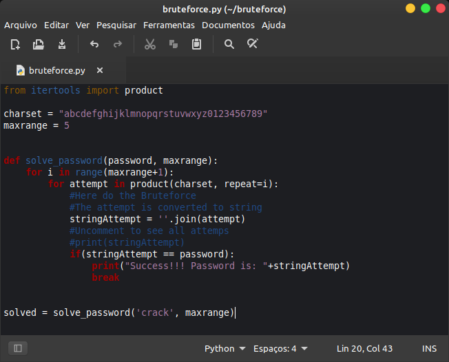
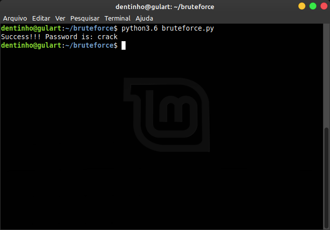

# The best, Most Simple and Efficiency Brute Force Code in Python

Hi! I'm **Lucas Gulart**. 
One day I was looking for a ready-made python brute force function and I couldn't find it anywhere. 

Thinking about it, I implemented parts and joined with the result of my research and finally decided to make the community available.

As the name says, this is **The best, Most Simple and Efficiency Brute Force Code in Python**.

Feel free to create your solutions using this code as a base!

# Screenshots

  
  

